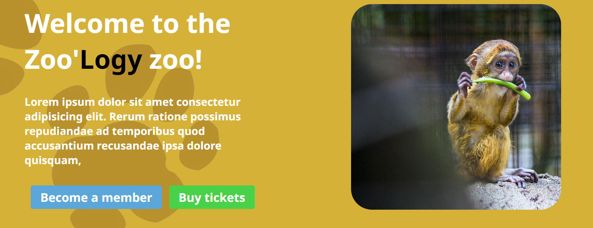

# Zoo Website Landing Page


Welcome to the repository for the Zoo Website Landing Page! This project is a responsive landing page for a zoo, designed to provide information about the zoo, its animals, exhibits, and more. The page features animations, a clean layout, and uses modern web development techniques.

## Tables of content
- [Features](#features)
- [Technologies Used](#technologies-used)
- [Setup](#setup)
- [IntersectionObserver API explained](#intersectionobserver-api)

## Features
- Responsive design for optimal viewing on various devices
- Animated elements that appear when scrolled into view using IntersectionObserver
- Information sections about animals, exhibits, events, and more
- Modern CSS techniques for styling and layout

## Technologies used
- HTML5
- CSS3
- JavaScript ([React](https://legacy.reactjs.org))
- IntersectionObserver API

## Setup
To run the project locally, run the following commands:

1. Clone the git repository
```bash
npm clone https://github.com/LordBugsy/zoo-website-landing-page.git
cd '.\zoo website landing page\'
```

2. Install the depedencies and run the development server
```bash
npm install
npm run dev
```

# IntersectionObserver API 
## Explanation
I used the IntersectionObserver API to trigger an animation when a section comes into view. In order to use it, you will need the following hooks:
- useEffect
- useRef

The example down below will cause the box to appear once it is visible on the page
```javascript
import React, { useEffect, useRef } from 'react';
import './App.css';

const App = () => {
    const boxRef = useRef(null);

    useEffect(() => {
        const observer = new IntersectionObserver(
            (entries) => {
                entries.forEach(entry => {
                if (entry.isIntersecting) {
                    entry.target.classList.add('visible');
                    observer.unobserve(entry.target); // stop observing once it is in view
                }
                });
            },
            {
                root: null, // relative to document viewport
                rootMargin: '0px',
                threshold: 0.1 // 10% of the element is visible
            }
        );

        if (boxRef.current) {
        observer.observe(boxRef.current);
        }

        return () => {
            if (boxRef.current) {
                observer.unobserve(boxRef.current); //make sure to unobserve the element you're referencing
            }
        };
    }, []);

    return (
        <div className="container">
            <div className="spacer"></div>
                <div ref={boxRef} className="box">Animate Me!</div> {/*here, give the div/section you want to animation the ref attribute of the constant you set earlier */}
            <div className="spacer"></div>
        </div>
    );
};

export default App;
```
```css

.spacer {
    margin: 800px;
}

.box {
    opacity: 0;
    transition: opacity 1s ease-in-out, transform 1s ease-in-out;
}

.box.visible {
    opacity: 1;
    transform: scale(1.1);
}
```

## License
This project is licensed under the MIT License. You are free to use, edit, and distribute this project as you'd like, under the terms of the MIT License. For more details, see the [LICENSE](https://github.com/LordBugsy/zoo-website-landing-page/blob/master/LICENSE.txt) file.